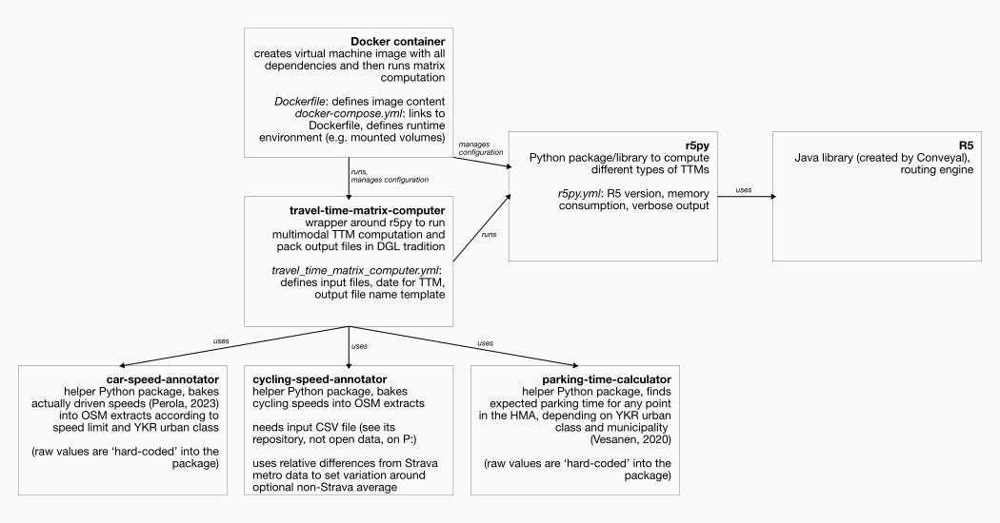
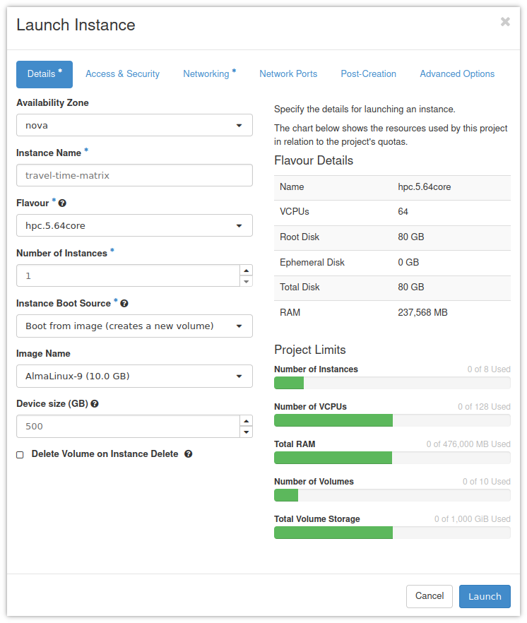

# Helsinki Travel Time Matrices

This repository contains the scripts (and some of the data) to compute travel
time matrices for the Helsinki metropolitan area, in a self-contained Docker
container.


## Dependencies

The docker container that can be built and run using the specification in this
repository depends on the following python packages:

- https://github.com/DigitalGeographyLab/travel-time-matrix-computer
- https://github.com/DigitalGeographyLab/cycling-speed-annotator
- https://github.com/DigitalGeographyLab/car-speed-annotator
- https://github.com/DigitalGeographyLab/parking-times-calculator

... which in turn depend on [r5py](https://r5py.readthedocs.io/),
[R5](https://github.com/conveyal/r5), and a Java Runtime Environment.


## Architecture

The components and dependencies relate to each other in the following way
(‘Docker container’ refers to the tool in this repository):




## Installation

These installation instructions are tailored to the use case and the
infrastructure available to the Digital Geography Lab. For instance, it uses a
virtual machine on [CSC Pouta](https://docs.csc.fi/cloud/pouta/) to run the
[docker host service](https://docs.docker.com/get-started/overview/), and refers
to input data sets that can be found on the groups network share (the
‘`P:`-drive’). If you work in a different environment, you will have to make
adjustments to these instructions.


### 1. Install a docker engine (here: on a CSC Pouta instance)

1. Create a new CSC Pouta instance, and use the following settings:
    - Flavour: `hpc.5.64core`
    - Instance Boot Source: ‘Boot from image (creates a new volume)’
    - Image Name: the newest AlmaLinux
    - Device size: 500 GB
    - Remember to use an SSH key pair that you have access to, and that you set
      appropriate firewall rules to be able to connect to the instance using SSH
      (port 22)



2. Assign a floating IP address to the instance

3. Connect to it using ssh (on Windows, use, e.g., Putty):
    ```
    ssh almalinux@128.214.x.x
    ```

4. Upgrade existing packages:
    ```
    sudo dnf update
    sudo dnf upgrade
    ```

5. Install `git` and `tmux`
    ```
    sudo dnf install git tmux
    ```

6. Set up additional [swap
   space](https://opensource.com/article/18/9/swap-space-linux-systems) (The
   output file repacking needs surprising amounts of extra RAM):
   ```
   # first, create a 200 GiB file full of zeros
   sudo dd if=/dev/zero of=/.swapfile count=200 bs=1GiB
   sudo chmod 0600 /.swapfile
   # then format it appropriately
   sudo mkswap /.swapfile
   ```

   Then, add the following line to the end of the config file `/etc/fstab`
   (e.g., using `vi`):
   ```
   /.swapfile    swap    swap    sw 0 0
   ```

6. Follow the [instructions to install the Docker engine on Centos (and similar, e.g., Alma)](https://docs.docker.com/engine/install/centos/#install-using-the-repository):
    ```
    sudo dnf install dnf-plugins-core
    sudo dnf config-manager --add-repo https://download.docker.com/linux/centos/docker-ce.repo
    sudo dnf install docker-ce docker-ce-cli containerd.io docker-buildx-plugin
    ```
    
    *(Note that I adapted these instructions to use `dnf` instead of the older
    `yum` that the docker instructions seem to prefer, but that might not be
    available on newer Alma versions)*

7. Enable the `docker` service
    ```
    sudo systemctl enable docker
    ```

8. Allow the default user to access docker
    ```
    sudo usermod -aG docker almalinux
    ```

9. Reboot the virtual machine
    ```
    sudo systemctl reboot
    ```

To save some setup work on future computation, you can keep the volume in Pouta
and then use ‘launch as an instance’ whenever you need it. That said, be sure to
always destroy/delete the instance itself once you’re done with computation and
have downloaded the resulting data sets, as the instance is consuming billing
units rapidly.


### 2. Clone this repository

On the CSC Pouta instance, check out this repository:

```
git clone https://github.com/DigitalGeographyLab/Helsinki-Travel-Time-Matrices.git
```

**If you re-use an existing docker engine image**, navigate to the directory and
`pull` the latest changes:

```
cd Helsinki-Travel-Time-Matrices
git pull
```

## Run the computation

### 1. Add input data sets and edit configuration file

Use `rsync` or any `scp` implementation (on Windows, e.g., WinSCP) to upload the
following input files to the `~/Helsinki-Travel-Time-Matrices/data/` directory:

- a full history dump of OpenStreetMap covering the study area (usually,
  `finland-internal.osh.pbf` from
  [Geofabrik *internal*](https://osm-internal.download.geofabrik.de/europe/finland.html))
- one or more GTFS files (historical files are available from
  [transit.land](https://transit.land/), for instance
- a cycling speed file (see
  https://github.com/DigitalGeographyLab/cycling-speed-annotator), the current
  one, derived from Strava Metro data, is in
  `P:\h510\metropaccess\Data\Travel_Time_Matrix\Travel Time Matrix
  2023\data\strava` (these data are not public/open!)
- a grid to serve as origins and destinations, in geopandas readable format,
  with at least a geometry (preferably point) and an `id` column. The YKR grid
  we have been using is in `P:\h510\metropaccess\Data\Travel_Time_Matrix\Travel
  Time Matrix 2023\data\ykr\`

Finally, edit the config file `travel_time_matrix_computer` to point to these
input files, adjust the study `date` and the `output_prefix` (how the result
files are named). Optionally, define the `extent` by copy-and-pasting a
*Well-Known Text* polygon.


### 2. Start the computation

Connect to the Pouta instance, optionally (but strongly recommended), start a
[tmux
session](https://hamvocke.com/blog/a-quick-and-easy-guide-to-tmux/#session-handling),
so computation would continue if you disconnect, then navigate to the
`Helsinki-Travel-Time-Matrices` directory and start the docker container that
runs the computation:

```
cd Helsinki-Travel-Time-Matrices
docker compose up
```

#### Troubleshooting

If there have been updates to the git repo since the last run, docker might not
always rebuild its container image. Remove it to force a rebuild before running
`docker compose up`:

```
docker system prune
```


### 3. Retrieve the output data

After computation has finished, use SCP to get the output data sets. They are
saved to `Helsinki-Travel-Time-Matrices/data/output/`.
